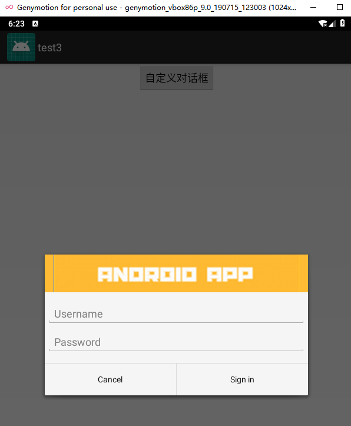

# 实验三 ：UI组件


## 1.Android ListView

#### 代码：

```java
public class SimpleAdapterTutorial extends Activity {

    //initialize view's
    ListView simpleListView;
    String[] animalName={"Lion","Tiger","Monkey","Dog","Cat","Elephant"};//animal names array
    int[] animalImages={R.drawable.lion,R.drawable.tiger,R.drawable.monkey,R.drawable.dog,R.drawable.cat,R.drawable.elephant};//animal images array
    @Override
    protected void onCreate(Bundle savedInstanceState) {
        super.onCreate(savedInstanceState);
        setContentView(R.layout.activity_simple_adapter_tutorial);
        simpleListView=(ListView)findViewById(R.id.simpleListView);

        ArrayList<HashMap<String,String>> arrayList=new ArrayList<>();
        for (int i=0;i<animalName.length;i++)
        {
            HashMap<String,String> hashMap=new HashMap<>();//create a hashmap to store the data in key value pair
            hashMap.put("name",animalName[i]);
            hashMap.put("image",animalImages[i]+"");
            arrayList.add(hashMap);//add the hashmap into arrayList
        }
        String[] from={"name","image"};//string array
        int[] to={R.id.textView,R.id.imageView};//int array of views id's
        SimpleAdapter simpleAdapter=new SimpleAdapter(this,arrayList,R.layout.list_view_items,from,to);//Create object and set the parameters for simpleAdapter
        simpleListView.setAdapter(simpleAdapter);//sets the adapter for listView

        //perform listView item click event
        simpleListView.setOnItemClickListener(new AdapterView.OnItemClickListener() {
            @Override
            public void onItemClick(AdapterView<?> adapterView, View view, int i, long l) {
                Toast.makeText(getApplicationContext(),animalName[i],Toast.LENGTH_LONG).show();//show the selected image in toast according to position
            }
        });
    }

    @Override
    public boolean onCreateOptionsMenu(Menu menu) {
        // Inflate the menu; this adds items to the action bar if it is present.
        getMenuInflater().inflate(R.menu.menu_main, menu);
        return true;
    }

    @Override
    public boolean onOptionsItemSelected(MenuItem item) {
        // Handle action bar item clicks here. The action bar will
        // automatically handle clicks on the Home/Up button, so long
        // as you specify a parent activity in AndroidManifest.xml.
        int id = item.getItemId();

        //noinspection SimplifiableIfStatement
        if (id == R.id.action_settings) {
            return true;
        }

        return super.onOptionsItemSelected(item);
    }
}

```


#### 布局预览：


## 2.AlertDialog

#### 代码：

```java
public class CustomDialogTutorial extends Activity {


    @Override
    protected void onCreate(Bundle savedInstanceState) {
        super.onCreate(savedInstanceState);
        setContentView(R.layout.activity_custom_dialog_tutorial);
        Button btn_custom_dialog = (Button)findViewById(R.id.custom_dialog_btn);
        btn_custom_dialog.setOnClickListener(new View.OnClickListener() {
            @Override
            public void onClick(View view) {
                createDialog();
            }
        });
    }

    public void createDialog() {
        AlertDialog.Builder builder = new AlertDialog.Builder(this);
        // Get the layout inflater
        LayoutInflater inflater = getLayoutInflater();

        // Inflate and set the layout for the dialog
        // Pass null as the parent view because its going in the dialog layout
        builder.setView(inflater.inflate(R.layout.custom_dialog, null))
                // Add action buttons
                .setPositiveButton(R.string.signin, new DialogInterface.OnClickListener() {
                    @Override
                    public void onClick(DialogInterface dialog, int id) {
                        // sign in the user ...
                    }
                })
                .setNegativeButton(R.string.cancel, new DialogInterface.OnClickListener() {
                    public void onClick(DialogInterface dialog, int id) {
                        //LoginDialogFragment.this.getDialog().cancel();
                    }
                });
        builder.create();
        builder.show();
    }

}


```


#### 布局预览




## 3.菜单

#### 代码:

```java
public class XmlDefineMenuTutorial extends Activity {
    TextView tv_test;

    @Override
    protected void onCreate(Bundle savedInstanceState) {
        super.onCreate(savedInstanceState);
        setContentView(R.layout.activity_xml_define_menu_tutorial);
        tv_test = (TextView) findViewById(R.id.tv_test);
    }

    @Override
    public boolean onCreateOptionsMenu(Menu menu) {
        this.getMenuInflater().inflate(R.menu.menu_settings, menu);
        return true;
    }

    @Override
    public boolean onOptionsItemSelected(MenuItem item) {
        switch (item.getItemId()) {
            case R.id.menu_font_small:
                tv_test.setTextSize(10*2);
                break;
            case R.id.menu_font_middle:
                tv_test.setTextSize(16*2);
                break;
            case R.id.menu_font_big:
                tv_test.setTextSize(20*2);
                break;
            case R.id.menu_normal:
                Toast.makeText(XmlDefineMenuTutorial.this, "这是普通菜单项", Toast.LENGTH_SHORT).show();
                break;
            case R.id.menu_color_red:
                tv_test.setTextColor(Color.RED);
                break;
            case R.id.menu_color_black:
                tv_test.setTextColor(Color.BLACK);
                break;
        }
        return true;
    }


}
```


#### 布局预览


## 4.上下文菜单

#### 代码:

```java
public class ContextualActionBarTutorial extends ListActivity {

    private String[] data = {"One", "Two", "Three", "Four", "Five", "Six", "Seven", "Eight", "Nine","Ten"};

    private SelectionAdapter mAdapter;

    @Override
    protected void onCreate(Bundle savedInstanceState) {
        super.onCreate(savedInstanceState);
        setContentView(R.layout.activity_contextual_action_bar_tutorial);

        mAdapter = new SelectionAdapter(this,
                R.layout.row_list_item, R.id.textView1, data);
        setListAdapter(mAdapter);
        getListView().setChoiceMode(ListView.CHOICE_MODE_MULTIPLE_MODAL);

        getListView().setMultiChoiceModeListener(new AbsListView.MultiChoiceModeListener() {

            private int nr = 0;

            @Override
            public boolean onPrepareActionMode(ActionMode mode, Menu menu) {
                // TODO Auto-generated method stub
                return false;
            }

            @Override
            public void onDestroyActionMode(ActionMode mode) {
                // TODO Auto-generated method stub
                mAdapter.clearSelection();
            }

            @Override
            public boolean onCreateActionMode(ActionMode mode, Menu menu) {
                // TODO Auto-generated method stub

                nr = 0;
                MenuInflater inflater = getMenuInflater();
                inflater.inflate(R.menu.contextual_menu, menu);
                return true;
            }

            @Override
            public boolean onActionItemClicked(ActionMode mode, MenuItem item) {
                // TODO Auto-generated method stub
                switch (item.getItemId()) {

                    case R.id.item_delete:
                        nr = 0;
                        mAdapter.clearSelection();
                        mode.finish();
                }
                return false;
            }

            @Override
            public void onItemCheckedStateChanged(ActionMode mode, int position,
                                                  long id, boolean checked) {
                // TODO Auto-generated method stub
                if (checked) {
                    nr++;
                    mAdapter.setNewSelection(position, checked);
                } else {
                    nr--;
                    mAdapter.removeSelection(position);
                }
                mode.setTitle(nr + " selected");

            }
        });

        getListView().setOnItemLongClickListener(new AdapterView.OnItemLongClickListener() {

            @Override
            public boolean onItemLongClick(AdapterView<?> arg0, View arg1,
                                           int position, long arg3) {
                // TODO Auto-generated method stub

                getListView().setItemChecked(position, !mAdapter.isPositionChecked(position));
                return false;
            }
        });
    }

    private class SelectionAdapter extends ArrayAdapter<String> {

        private HashMap<Integer, Boolean> mSelection = new HashMap<Integer, Boolean>();

        public SelectionAdapter(Context context, int resource,
                                int textViewResourceId, String[] objects) {
            super(context, resource, textViewResourceId, objects);
        }

        public void setNewSelection(int position, boolean value) {
            mSelection.put(position, value);
            notifyDataSetChanged();
        }

        public boolean isPositionChecked(int position) {
            Boolean result = mSelection.get(position);
            return result == null ? false : result;
        }

        public Set<Integer> getCurrentCheckedPosition() {
            return mSelection.keySet();
        }

        public void removeSelection(int position) {
            mSelection.remove(position);
            notifyDataSetChanged();
        }

        public void clearSelection() {
            mSelection = new HashMap<Integer, Boolean>();
            notifyDataSetChanged();
        }

        @Override
        public View getView(int position, View convertView, ViewGroup parent) {
            View v = super.getView(position, convertView, parent);//let the adapter handle setting up the row views
            v.setBackgroundColor(getResources().getColor(android.R.color.background_light)); //default color

            if (mSelection.get(position) != null) {
                v.setBackgroundColor(getResources().getColor(android.R.color.holo_blue_light));// this is a selected position so make it red
            }
            return v;
        }
    }
}
```

#### 布局预览


