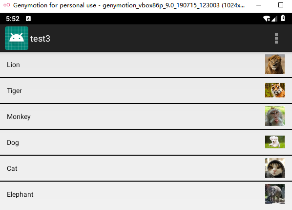

# 实验三 ：UI组件


## 1.Android ListView

#### 关键代码：

- 将图像储存于键值对

  ```java
  HashMap<String,String> hashMap=new HashMap<>();
  hashMap.put("name",animalName[i]);
  hashMap.put("image",animalImages[i]+"");
  arrayList.add(hashMap);
  ```


- 创建simpleadapter

  ```java
  SimpleAdapter simpleAdapter=new SimpleAdapter(this,arrayList,R.layout.list_view_items,from,to); simpleListView.setAdapter(simpleAdapter);
  ```

- 设置鼠标点击事件显示内容

  ```java
   simpleListView.setOnItemClickListener(new AdapterView.OnItemClickListener() {
            
              public void onItemClick(AdapterView<?> adapterView, View view, int i, long l) {
                  Toast.makeText(getApplicationContext(),animalName[i],Toast.LENGTH_LONG).show();
              }
          });
  ```

  

#### 预览：




## 2.AlertDialog

#### 关键代码：

- 创建AlertDialog

  ```java
    AlertDialog.Builder builder = new AlertDialog.Builder(this);
    
            
                  .setPositiveButton(R.string.signin, new DialogInterface.OnClickListener() {
                      @Override
                      public void onClick(DialogInterface dialog, int id) {
                          // sign in the user ...
                      }
                  })
                  .setNegativeButton(R.string.cancel, new DialogInterface.OnClickListener() {
                      public void onClick(DialogInterface dialog, int id) {
                          //LoginDialogFragment.this.getDialog().cancel();
                      }
                  });
          builder.create();
          builder.show();
  ```

- 设置两个按钮

  ```java
  builder.setView(inflater.inflate(R.layout.alertdialog, null))
                  // Add action buttons
                  .setPositiveButton(R.string.signin, new DialogInterface.OnClickListener() {
                      @Override
                      public void onClick(DialogInterface dialog, int id) {
                          // sign in the user ...
                      }
                  })
                  .setNegativeButton(R.string.cancel, new DialogInterface.OnClickListener() {
                      public void onClick(DialogInterface dialog, int id) {
                          //LoginDialogFragment.this.getDialog().cancel();
                      }
                  });
          builder.create();
          builder.show();
  ```


#### 预览：


## 3.菜单

#### 关键代码:

```java
 public boolean onOptionsItemSelected(MenuItem item) {
        switch (item.getItemId()) {
            case R.id.menu_font_small:
                tv_test.setTextSize(10*2);
                break;
            case R.id.menu_font_middle:
                tv_test.setTextSize(16*2);
                break;
            case R.id.menu_font_big:
                tv_test.setTextSize(20*2);
                break;
            case R.id.menu_normal:
                Toast.makeText(XmlDefineMenuTutorial.this, "这是普通菜单项", Toast.LENGTH_SHORT).show();
                break;
            case R.id.menu_color_red:
                tv_test.setTextColor(Color.RED);
                break;
            case R.id.menu_color_black:
                tv_test.setTextColor(Color.BLACK);
                break;
        }
        return true;
    }
```


#### 预览：


## 4.上下文菜单

#### 关键代码:

- 选中计数

  ```java
  public void onItemCheckedStateChanged(ActionMode mode, int position,
                                                    long id, boolean checked) {
                  // TODO Auto-generated method stub
                  if (checked) {
                      nr++;
                      mAdapter.setNewSelection(position, checked);
                  } else {
                      nr--;
                      mAdapter.removeSelection(position);
                  }
                  mode.setTitle(nr + " selected");
  
              }
  ```

  

#### 预览：


