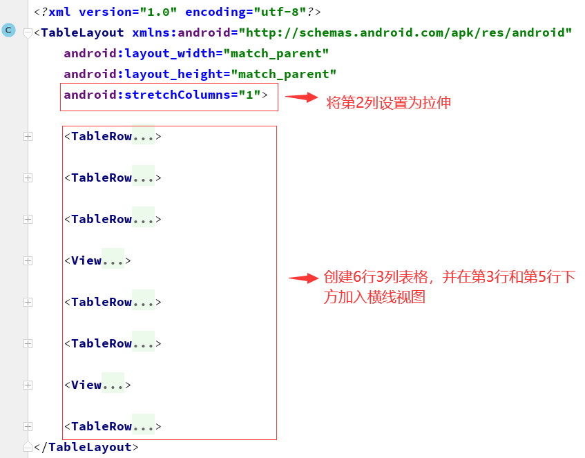

# 实验二 ：Android界面布局


## 1.线性布局

#### 总体布局：在线性布局中创建四个线性子布局，按照垂直排列，每个线性子布局中创建4个按钮，按照水平排列，每个按钮宽度为适应父布局


#### 详细布局代码：

```xml
<?xml version="1.0" encoding="utf-8"?>
<LinearLayout xmlns:android="http://schemas.android.com/apk/res/android"
    android:layout_width="match_parent"
    android:layout_height="wrap_content"
    android:orientation="vertical" >
<LinearLayout
    android:layout_width="match_parent"
    android:layout_height="wrap_content"
    android:orientation="horizontal">
    <Button android:id="@+id/按钮1"
        android:layout_width="wrap_content"
        android:layout_height="wrap_content"
        android:layout_weight="1"
        android:text="one,one" />
    <Button android:id="@+id/按钮2"
        android:layout_width="wrap_content"
        android:layout_height="wrap_content"
        android:layout_weight="1"
        android:text="one,two"/>
    <Button android:id="@+id/按钮3"
        android:layout_width="wrap_content"
        android:layout_height="wrap_content"
        android:layout_weight="1"
        android:text="one,three"/>
    <Button android:id="@+id/按钮4"
        android:layout_width="wrap_content"
        android:layout_height="wrap_content"
        android:layout_weight="1"
        android:text="one,four" />
</LinearLayout>

<LinearLayout
    android:layout_width="match_parent"
    android:layout_height="wrap_content"
    android:orientation="horizontal">

    <Button android:id="@+id/按钮5"
        android:layout_width="wrap_content"
        android:layout_height="wrap_content"
        android:layout_weight="1"
        android:text="two,one" />
    <Button android:id="@+id/按钮6"
        android:layout_width="wrap_content"
        android:layout_height="wrap_content"
        android:layout_weight="1"
        android:text="two,two"/>
    <Button android:id="@+id/按钮7"
        android:layout_width="wrap_content"
        android:layout_height="wrap_content"
        android:layout_weight="1"
        android:text="two,three"/>
    <Button android:id="@+id/按钮8"
        android:layout_width="wrap_content"
        android:layout_height="wrap_content"

        android:text="two,four" />
</LinearLayout>

<LinearLayout
    android:layout_width="match_parent"
    android:layout_height="wrap_content"
    android:orientation="horizontal">
    <Button android:id="@+id/按钮9"
        android:layout_width="wrap_content"
        android:layout_height="wrap_content"
        android:text="three,one" />
    <Button android:id="@+id/按钮10"
        android:layout_width="wrap_content"
        android:layout_height="wrap_content"
        android:text="three,two"/>
    <Button android:id="@+id/按钮11"
        android:layout_width="wrap_content"
        android:layout_height="wrap_content"
        android:text="three,three"/>
    <Button android:id="@+id/按钮12"
        android:layout_width="match_parent"
        android:layout_height="match_parent"
        android:text="three,four" />
</LinearLayout>

<LinearLayout
    android:layout_width="match_parent"
    android:layout_height="wrap_content"
    android:orientation="horizontal">

    <Button android:id="@+id/按钮13"
        android:layout_width="wrap_content"
        android:layout_height="wrap_content"
        android:text="four,one" />
    <Button android:id="@+id/按钮14"
        android:layout_width="wrap_content"
        android:layout_height="wrap_content"
        android:text="four,two"/>
    <Button android:id="@+id/按钮15"
        android:layout_width="wrap_content"
        android:layout_height="wrap_content"
        android:text="four,three"/>
    <Button android:id="@+id/按钮16"
        android:layout_width="match_parent"
        android:layout_height="match_parent"
        android:text="four,four" />
</LinearLayout>

</LinearLayout>
```


#### 布局预览：


## 2.自适应布局

#### 总体布局：创建7个不同颜色的按钮，其中：

#### 红色位于parent的左上角，橙色位于顶部居中，黄色位于右上角

#### 紫罗兰色位于底部且宽度充满parent

#### 绿色和紫色与蓝色顶部对齐，绿色右边与橙色左边对齐，紫色左边与橙色右边对齐，蓝色与橙色margin 10


#### 详细布局代码：

```xml
<?xml version="1.0" encoding="utf-8"?>
<android.support.constraint.ConstraintLayout xmlns:android="http://schemas.android.com/apk/res/android"
    xmlns:app="http://schemas.android.com/apk/res-auto"
    xmlns:tools="http://schemas.android.com/tools"
    android:layout_width="match_parent"
    android:layout_height="match_parent"
    android:orientation="horizontal"
    >

    <Button
        android:id="@+id/button1"
        android:layout_width="70dp"
        android:layout_height="60dp"
        android:background="@android:color/holo_red_light"
        app:layout_constraintTop_toTopOf="parent"
        app:layout_constraintleft_toleftOf="parent"
        tools:text="RED" />

    <Button
        android:id="@+id/button2"
        android:layout_width="100dp"
        android:layout_height="60dp"
        app:layout_constraintEnd_toEndOf="parent"
        app:layout_constraintStart_toStartOf="parent"
        android:background="@android:color/holo_orange_dark"
        android:text="ORANGE"

        app:layout_constraintLeft_toRightOf="@id/button1"
        app:layout_constraintTop_toBottomOf="parent"
        />

    <Button
        android:id="@+id/button3"
        android:layout_width="85dp"
        android:layout_height="60dp"
        android:background="@android:color/holo_orange_light"
        android:text="YELLOW"
        app:layout_constraintRight_toRightOf="parent"
        app:layout_constraintTop_toBottomOf="parent"
        />

    <Button
        android:id="@+id/button4"
        android:layout_width="70dp"
        android:layout_height="60dp"
        android:layout_marginTop="80dp"
        android:background="@android:color/holo_blue_dark"
        android:text="BLUE"

        app:layout_constraintEnd_toEndOf="parent"
        app:layout_constraintStart_toStartOf="parent"
        app:layout_constraintTop_toTopOf="parent" />

    <Button
        android:id="@+id/button5"
        android:layout_width="70dp"
        android:layout_height="60dp"

        android:background="@android:color/holo_green_dark"
        android:text="GREEN"
        app:layout_constraintRight_toLeftOf="@id/button2"
        app:layout_constraintTop_toTopOf="@id/button4" />

    <Button
        android:id="@+id/button6"
        android:layout_width="70dp"
        android:layout_height="60dp"
        android:background="@color/colorPrimaryDark"
        android:text="INDIGO"
        app:layout_constraintLeft_toRightOf="@id/button2"
        app:layout_constraintTop_toTopOf="@id/button4" />

    <Button
        android:id="@+id/button7"
        android:layout_width="match_parent"
        android:layout_height="60dp"
        android:background="@color/colorPrimary"
        android:text="VIOLET"
        app:layout_constraintBottom_toBottomOf="parent"

         />

</android.support.constraint.ConstraintLayout>

```


#### 布局预览


## 3.表格布局

#### 总体布局：创建一个3列6行的表格布局，其中：

#### 1，2，3行的第1列为空，表格第2列设置拉伸充满屏幕，第3列文本设置为文字靠右，在第3行和第5行下方加入横线视图




#### 具体布局代码:

```xml
<?xml version="1.0" encoding="utf-8"?>
<TableLayout xmlns:android="http://schemas.android.com/apk/res/android"
    android:layout_width="match_parent"
    android:layout_height="match_parent"
    android:stretchColumns="1">

    <TableRow>
        <TextView
            android:layout_column="1"
            android:text="Open..."
            android:padding="3dip"/>

        <TextView
            android:text="Ctrl-O"
            android:gravity="right"
            android:padding="3dip"/>
    </TableRow>

    <TableRow>
        <TextView
            android:layout_column="1"
            android:text="Save..."
            android:padding="3dip"/>
        <TextView
            android:text="Ctrl-S"
            android:layout_gravity="right"
            android:padding="3dip"/>T
    </TableRow>

    <TableRow>
        <TextView
            android:layout_column="1"
            android:text="Save As..."
            android:padding="3dip"/>
        <TextView
            android:text="Ctrl-Shift-s"
            android:layout_gravity="right"
            android:padding="3dip"/>
    </TableRow>

    <View
        android:layout_height="2dip"
        android:background="#FF909090"
        />

    <TableRow>
        <TextView
            android:text="X"
            android:padding="3dip"/>
        <TextView
            android:text="Import..."
            android:padding="3dip"/>
    </TableRow>

    <TableRow>
        <TextView
            android:text="X"
            android:padding="3dip"/>
        <TextView
            android:text="Export.."
            android:padding="3dip"/>
        <TextView
            android:text="Ctrl-E"
            android:layout_gravity="right"
            android:padding="3dip"/>
    </TableRow>

    <View
        android:layout_height="2dip"
        android:background="#FF909090"
        />

    <TableRow>
        <TextView
            android:layout_column="1"
            android:text="Quit"
            android:padding="3dip"/>
    </TableRow>
</TableLayout>


```


#### 布局预览

