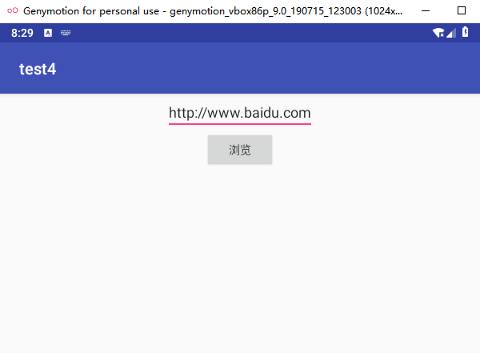
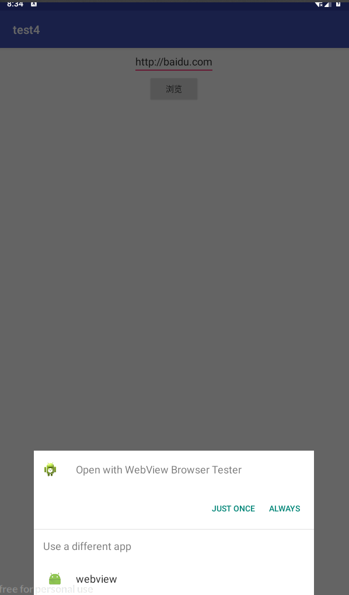
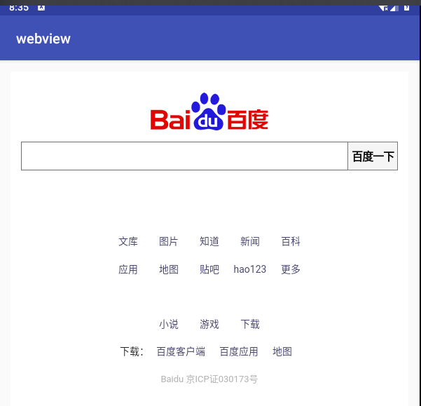

# 实验四 ：Intent


## 1.创建应用获取url

#### 关键代码：

- 设置浏览按钮监听事件：启动了Intent  

  ```java
     button.setOnClickListener(new View.OnClickListener() {
              @Override
              public void onClick(View view) {
                  String url = EditText.getText().toString();
                  Intent intent = new Intent();
                  intent.setAction(Intent.ACTION_VIEW);
                  intent.setData(Uri.parse(url));
                  startActivity(intent);
              }
  ```


#### 预览：




## 2.创建应用加载url

#### 关键代码：

- 创建Intent对象 并开始浏览

  ```java
  		Intent intent = getIntent();
  
          Uri data = intent.getData();
          URL url = null;
  
          try {
              url = new URL(data.getScheme(), data.getHost(),
                      data.getPath());
          } catch (Exception e) {
              e.printStackTrace();
          }
  
          startBrowser(url);
      }
  
  ```

- 使用webview加载资源

  ```java
          webView.loadUrl(url.toString());
          //覆盖WebView默认使用第三方或系统默认浏览器打开网页的行为，使网页用WebView打开
          webView.setWebViewClient(new WebViewClient(){
              @Override
              public boolean shouldOverrideUrlLoading(WebView view, String url) {
                  // TODO Auto-generated method stub
                  //返回值是true的时候控制去WebView打开，为false调用系统浏览器或第三方浏览器
                  view.loadUrl(url);
                  return true;
              }
          });
  ```
  
  ```
   <intent-filter>
                  <action android:name="android.intent.action.VIEW" />
                  <category android:name="android.intent.category.DEFAULT" />
                  <data android:scheme="http" />
              </intent-filter>
  ```
  
  

#### 预览：







