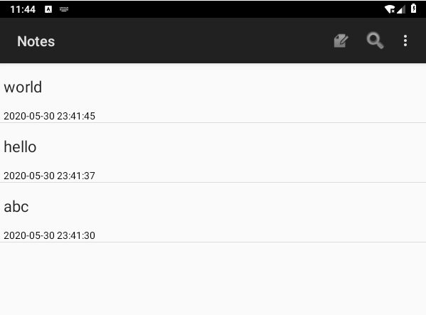
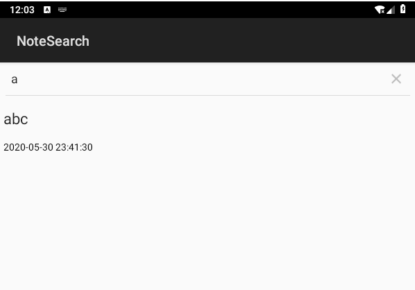

# 期中实验：NotePad笔记本应用


## 1.增加时间戳显示

#### 关键代码：

- 1.在PROJECTION中添加显示时间

  ```java
  private static final String[] PROJECTION = new String[] {
              NotePad.Notes._ID, 
              NotePad.Notes.COLUMN_NAME_TITLE, 
              NotePad.Notes.COLUMN_NAME_MODIFICATION_DATE,
      };
  ```

- 2.并在dataColumns中将时间显示在标题下方,样式id分别为text1,text2、

  ```java
   String[] dataColumns = {
                  NotePad.Notes.COLUMN_NAME_TITLE,
                  NotePad.Notes.COLUMN_NAME_MODIFICATION_DATE
          } ;
   int[] viewIDs = { R.id.text1 ,R.id.text2};
  ```

  样式如下：

  ```xml
   <!--原标题TextView-->
      <TextView xmlns:android="http://schemas.android.com/apk/res/android"
  
          android:id="@+id/text1"
          android:layout_width="match_parent"
          android:layout_height="?android:attr/listPreferredItemHeight"
          android:textAppearance="?android:attr/textAppearanceLarge"
          android:gravity="center_vertical"
          android:paddingLeft="5dip"
          android:singleLine="true"
  
          />
  <!--添加显示时间的TextView-->
      <TextView
          android:id="@+id/text2"
          android:layout_width="match_parent"
          android:layout_height="wrap_content"
          android:textAppearance="?android:attr/textAppearanceSmall"
          android:paddingLeft="5dip"
          android:textColor="#000000"/>
  ```

  

- 3.再通过SimpleCursorAdapter装配

  ```java
  Cursor cursor = managedQuery(
              getIntent().getData(),            // Use the default content URI for the provider.
              PROJECTION,                       // Return the note ID and title for each note.
              null,                             // No where clause, return all records.
              null,                             // No where clause, therefore no where column values.
              NotePad.Notes.DEFAULT_SORT_ORDER  // Use the default sort order.
          );
  
  SimpleCursorAdapter adapter
                  = new SimpleCursorAdapter(
                  this,                             // The Context for the ListView
                  R.layout.noteslist_item,          // Points to the XML for a list item
                  cursor,                           // The cursor to get items from
                  dataColumns,
                  viewIDs,
                  CursorAdapter.FLAG_REGISTER_CONTENT_OBSERVER
          );
  ```

  

- 4.在NotePadProvider.java和NoteEditor.java中标准化时间类型

  ```java
  // Gets the current system time in milliseconds
          Long now = Long.valueOf(System.currentTimeMillis());
          Date date = new Date(now);
          SimpleDateFormat format = new SimpleDateFormat("yy.MM.dd HH:mm:ss");
          String dateTime = format.format(date);
  ```

  

#### 预览：




## 2.添加搜索功能

#### 关键代码：

- 1.在menu中添加一个搜索按钮

  ```xml
   <item
          android:id="@+id/menu_search"
          android:title="@string/menu_search"
          android:icon="@android:drawable/ic_search_category_default"
          android:showAsAction="always">
      </item>
  ```
  
  
  
- 2.为搜索界面添加线性布局

  ```xml
  <?xml version="1.0" encoding="utf-8"?>
  <LinearLayout xmlns:android="http://schemas.android.com/apk/res/android"
      android:orientation="vertical"
      android:layout_width="match_parent"
      android:layout_height="match_parent">
      <SearchView
          android:id="@+id/search_view"
          android:layout_width="match_parent"
          android:layout_height="wrap_content"
          android:queryHint="请输入搜索内容..."
          >
      </SearchView>
  
      <ListView
          android:id="@android:id/list"
          android:layout_width="match_parent"
          android:layout_height="wrap_content">
      </ListView>
  
  
  </LinearLayout>
  
  ```

  

- 3.在NoteList中找到onOptionsItemSelected方法,给搜索按键添加功能

  ```java
  case R.id.menu_search:
      Intent intent = new Intent();
      intent.setClass(NotesList.this,NoteSearch.class);
      NotesList.this.startActivity(intent);
      return true;
  ```

  

- 4.搜索功能实现

  ```java
  package com.example.android.notepad;
  
  import com.example.android.notepad.NotePad;
  
  import android.annotation.TargetApi;
  import android.os.Build;
  import android.widget.SearchView;
  import android.app.ListActivity;
  import android.content.ClipboardManager;
  import android.content.ClipData;
  import android.content.ComponentName;
  import android.content.ContentUris;
  import android.content.Context;
  import android.content.Intent;
  import android.database.Cursor;
  import android.net.Uri;
  import android.os.Bundle;
  import android.util.Log;
  import android.view.ContextMenu;
  import android.view.Menu;
  import android.view.MenuInflater;
  import android.view.MenuItem;
  import android.view.View;
  import android.view.ContextMenu.ContextMenuInfo;
  import android.widget.AdapterView;
  import android.widget.ListView;
  
  import android.widget.CursorAdapter;
  import android.widget.SimpleCursorAdapter;
  
  public class NoteSearch extends ListActivity  implements SearchView.OnQueryTextListener {
      private static final String[] PROJECTION = new String[] {
              NotePad.Notes._ID, // 0
              NotePad.Notes.COLUMN_NAME_TITLE, // 1
              //扩展 显示时间 颜色
              NotePad.Notes.COLUMN_NAME_MODIFICATION_DATE, // 2
      };
      @Override
      protected void onCreate(Bundle savedInstanceState) {
          super.onCreate(savedInstanceState);
          setContentView(R.layout.note_search_list);
          Intent intent = getIntent();
          if (intent.getData() == null) {
              intent.setData(NotePad.Notes.CONTENT_URI);
          }
          SearchView searchview = (SearchView)findViewById(R.id.search_view);
          //为查询文本框注册监听器
          searchview.setOnQueryTextListener(NoteSearch.this);
      }
      @Override
      public boolean onQueryTextSubmit(String query) {
          return false;
      }
      @Override
      public boolean onQueryTextChange(String newText) {
          String selection = NotePad.Notes.COLUMN_NAME_TITLE + " Like ? ";
          String[] selectionArgs = { "%"+newText+"%" };
          Cursor cursor = managedQuery(
                  getIntent().getData(),            // Use the default content URI for the provider.
                  PROJECTION,                       // Return the note ID and title for each note. and modifcation date
                  selection,                        // 条件左边
                  selectionArgs,                    // 条件右边
                  NotePad.Notes.DEFAULT_SORT_ORDER  // Use the default sort order.
          );
          String[] dataColumns = { NotePad.Notes.COLUMN_NAME_TITLE ,  NotePad.Notes.COLUMN_NAME_MODIFICATION_DATE };
          int[] viewIDs = { R.id.text1 , R.id.text2 };
          SimpleCursorAdapter adapter = new SimpleCursorAdapter(
                  this,
                  R.layout.noteslist_item,
                  cursor,
                  dataColumns,
                  viewIDs
          );
          setListAdapter(adapter);
          return true;
      }
      @Override
      protected void onListItemClick(ListView l, View v, int position, long id) {
          // Constructs a new URI from the incoming URI and the row ID
          Uri uri = ContentUris.withAppendedId(getIntent().getData(), id);
          // Gets the action from the incoming Intent
          String action = getIntent().getAction();
          // Handles requests for note data
          if (Intent.ACTION_PICK.equals(action) || Intent.ACTION_GET_CONTENT.equals(action)) {
              // Sets the result to return to the component that called this Activity. The
              // result contains the new URI
              setResult(RESULT_OK, new Intent().setData(uri));
          } else {
              // Sends out an Intent to start an Activity that can handle ACTION_EDIT. The
              // Intent's data is the note ID URI. The effect is to call NoteEdit.
              startActivity(new Intent(Intent.ACTION_EDIT, uri));
          }
      }
  }
  
  
  ```

  

- 5.在AndroidManifest.xml中添加搜索activity

  ```xml
   <activity
          android:name="NoteSearch"
          android:label="@string/title_notes_search">
      </activity>
  ```

  

#### 预览：




